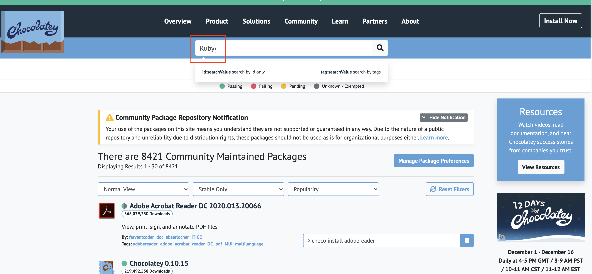
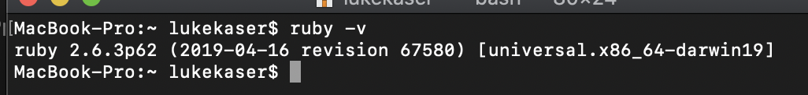
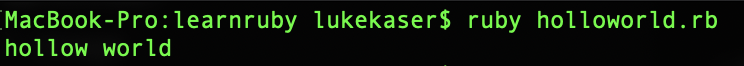

## Ruby の世界をようこそ
---
このファイルはMarkDownの型式で書いたものです。
VsCodeとか　MarkDownが支援しているエディターを利用してください
---
環境準備する前に、Rubyというプログラミング言語を話しましょう
「Ruby」はプログラミング言語として、簡単で綺麗な言語です。

## 環境準備
---
今回は[chocolatey](https://chocolatey.org/)というツール管理を使います。

### Step.1 chocolateyのインストール
chocolateyのサイドを開いて下記のコードをPowerShellに貼り付けて実行して下さい。
```
Set-ExecutionPolicy Bypass -Scope Process -Force; [System.Net.ServicePointManager]::SecurityProtocol = [System.Net.ServicePointManager]::SecurityProtocol -bor 3072; iex ((New-Object System.Net.WebClient).DownloadString('https://chocolatey.org/install.ps1'))
```

[コード先](https://chocolatey.org/install#individual)

### Step.2　chocolateyの公式サイドでツールをインストール
[chocolatey](https://chocolatey.org/)のホームページに戻って[Find Packages](https://chocolatey.org/packages)をクリックしてツール検索ページに移動します。



検索をすると一番目の[Ruby2.7.2.1]をクリックして、[Version History]の中にRuby2.3.3を探してください。

見つからなかったら、このリンクを利用してください→
[Ruby2.3.3](https://chocolatey.org/packages/ruby/2.3.3)


インストールのコードをコピして、PowerShellを張り付いて実行したら自動インストールことができます。
```
choco install ruby --version=2.3.3
```

インストールが終わったら、下記のコードを使ってPowerShellでRubyのバージョンを確認しましょう。
```
ruby -v
```
例：今回目標インストールのバージョンは2.3.3
です。下記の手本と違うバージョンです。


---

## Hello World
さっそく最初のHello　Worldの練習をしましょう！

適当な場所で「HelloWorld.txt」のファイルを作成してみてください。
[ファイルのエクステンション]とはファイルの種類の省略名というものです。

> コンピューターの世界に様々なエクステンションがあります。例えば：xxx.doc, xxx.mp3, xxx.xls　それはファイルによって特別な圧縮方法やファイルの書き方法です。

ファイルを保存する時、ファイルの [ エクステンション ] が「.rb」として保存すれば、「Ruby」専用のファイルに変更することができます。

ファイル中の内容は下記のようを書いてみてください
```
string="hollow world"
puts string
```
>Rubyの世界に変数のタイプが分かりにくいです。
そして、コードの行尾のところで行の終了意味としてのセミコロンが0必要ではありません。

>ここの「string」は変数として利用していて、値は
ストリングタイプの”Hollo world”です

>ここの「puts」は「Ruby」のプログラミング言語専用の「吐き出す」の方法です。「吐き出す/Print」とはプログラミング言語領域中に、文字のプリンターというもので、指定の内容を画面の中で表示することです。

出来上がったら、PowerShellを開いて、現在ファイルにあるフォールダーの場所に移動してください。
>PowerShellの現在位置を変更する方法は
cd xxxxxxxx　※xxxxxxはパスです。
```
cd C:¥User¥desktop
```
ディスクの移動は下記のように叩いたら、別のディスクに移動することができます。
```
cd D:
```

そして、PowerShellで下記のコードを叩いてみてください
```
ruby helloworld.rb
```



ここまでたどり着いたら最初のHello Worldができました。