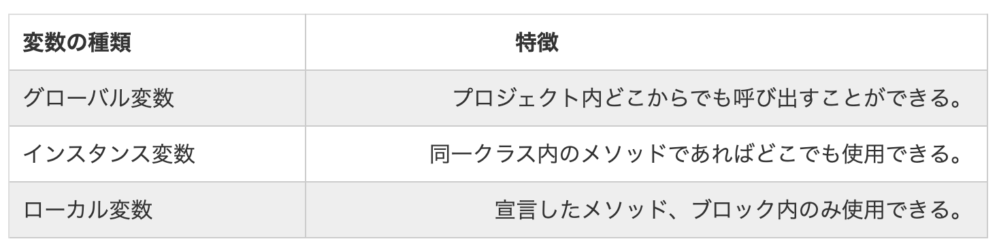
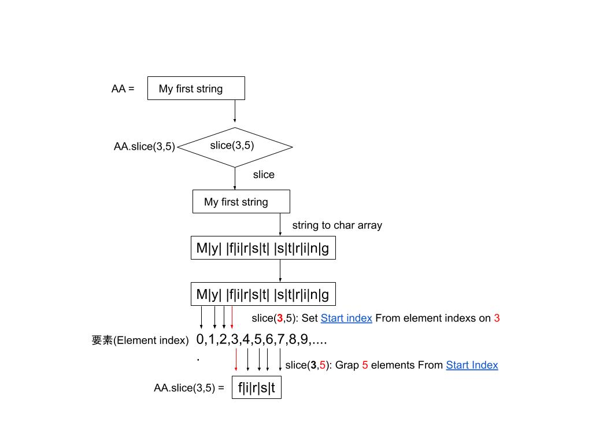
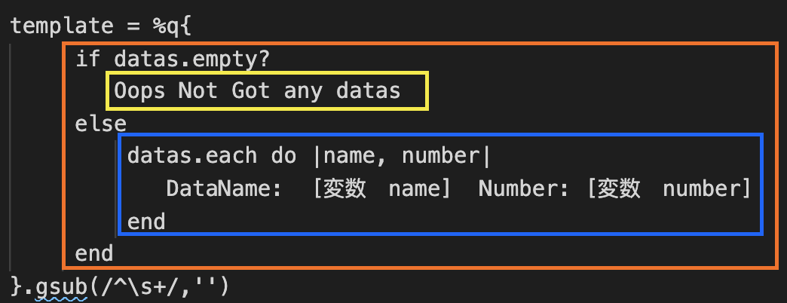

## ストリングワールド
---
ストリングはプログラミングの世界中にありふれる変数のタイプです。

Rubyのストリングと他のプログラミング言語と大体同じですが、
Rubyの世界でストリングはもっとダイナミックで変えやすいです。

Rubyの世界は物に意味を付与する方法が下記のようになっています。
```
変数名 = 値
aaa = 1 # => 一般の変数
AAA = 1 # => グローバル変数
```
>Rubyの世界で変数名は全部大文字の場合「グローバル変数」に定義できます。基本的には下記の三種類があります。

もっと勉強しましょ → [Ruby変数の種類と違い](https://qiita.com/tomokichi_ruby/items/a2548176d85457f622a4)

ちなみに、他のプログラミング言語はもっと丁寧の形になっています
例えC#は下記のようになっている
```
タイプ　変数名　= 値
```
さそく幾つ役に立つのAPIを見て試してみましょう！

### String#slice ストリングを切る
---
ストリングをスライスする時は、下記のAPIを使えばストリングの切り分けることができます。
```
aa="My first string"
puts aa.slice(3,5) # => 「first」
```
◆練習:stringworld_01.rb

> コードを運行した結果は「first」が表示されます
コードの視点は下記のように運行しています。
``` 
”My first string”.slice(3,5)
↓ ストリングからChar配列に変換する
{'M','y',' ','f','i','r','s','t',' ','s','t','r','i','n','g'}
要素1　= 'M', 要素2 = 'y', 要素3 = ' '.....
↓ slice(3,5)
代入値1の3は要素3からスライスを行う意味です。
代入値2の5は要素3から五つ要素を取る意味です。
※APIごとにその実行の結果と代入値必要な数と意味も変わります。
```

「AA.slice(代入値1,代入値2)」について説明をします。
>スライス最初代入の値1は「3」です。その「3」の意味は"My first string"が「スライス」の方法を利用して、変数AAのストリングはCharの配列として、そのchar配列の中にの第3個目の値からスライスを行う意味です。

>スライスの二番目の代入値2の「5」は、幾つの要素を取るの意味であります。今回は五つ要素を取ります。

>補足：「ストリングからChar配列に変換する」意味とは「"ABC"一つの単位」から複数の「{'A','B','C'}」のChar配列になる意味である。

「AA.slice（start index,select chars from index）」AA.slice(開始場所, 開始場所から幾つの文字を取得する)

String#sliceに関して詳しいAPI内容はこちらへ → [String#slice](https://apidock.com/ruby/String/slice)


### String#upcase
---
ストリングは大文字に変更するAPIです。
```
aa="My string"
aa.upcase # => "My string"
puts aa.upcase # => "MY STRING"
aa.upcase! # => "MY STRING"
```
>行尾で「！」を付けると変数の直接転換することができます。

◆練習:stringworld_01.rb


### String#empty?
ストリングが空きかどうかを判断するAPIです。
```
aa.empty?   # => TRUE
aa="String" # => "String"
aa.empty?   # => FALSE
```
◆練習:stringworld_01.rb

### String#include?
ストリングが指定のストリングが含めているかどうかを判断するAPIです。
```
aa="String"        # => "String"
aa.include? 'A'    # => FALSE
aa.include? 'Str'  # => TRUE
aa.include? 'tri'  # => TRUE
aa.include? 'n'    # => TRUE
```
◆練習:stringworld_01.rb
## イテレーション (iterate)
---
### << で内容の増やす
Rubyのプログラミグ言語で、変数に要素を設定するや、追加するなどの方法は幾つがあって今回は「<<」の方法を紹介をします。

この「<<」方法はとても使いやすいが、使いすぎてコードが長くなってしまうことがしやすいから。
>常に、コードをシンプルにして綺麗な状態に維持することが心に留めてください。

ストリング変数を内容を増やす時は普段は「+」の方法で実現するですが、実際の「+」は「加算」の意味もあります。

そして、今回紹介したいの「<<」はアペンド（append）というの方法です。
```
aa="Abc"
aa << "DDD"
puts aa #=> "AbcDDD"
```
◆練習:stringworld_02.rb
### ストリングで他の変数を代入する
Rubyのプログラミング言語はストリングタイプで他の変数を差し込むことができます。このことは全部のプログラミング言語にもできますが、言語ごとに差し込むの方法もちょっと違いますよ。
```
number = 5
bb = "I Got #{number} " # => "I Got 5"

bb = "The number after #{number} is #{number.next} " # => "The number after 5 is 6"

bb = "The number before #{number} is #{number-1} " # => "The number before 5 is 4"

bb = "We're ##{number}!" # => "We're #5!"
```
◆練習:stringworld_02.rb

Api → [[ next ]](https://apidock.com/ruby/Integer/next)

### ストリングのエスケープ処理（escape processing）
>ストリングを使う時、もし「\」の次は[n]を続けて記されたら、その出力結果は[\n]じゃなくて「改行」になってしまった。

>どうして考え通りの[\n]の出力結果にならないのは「エスケープ処理」が発生しましたから。
```
puts "This is string \n good idea"
# => 出力結果
# line 1 "This is string "
# line 2 " good idea"
```
「エスケープ処理」を避けるために[\]の前にもう一つ[\\]を追加したら「エスケープ処理」を避けることができますよ。
```
puts "This is string \\n good idea"
# => 出力結果
# line 1 "This is string n good idea"
```

「エスケープ処理」とは、プログラミング言語やソフトウェアで文字列を扱う際に、特定の記号文字などに続けて記された文字（の並び）に、その文字本来の意味とは異なる特別な意味や機能を与えること。先頭の特殊な文字を「エスケープ文字」という。
もっと勉強しましょう → [エスケープ処理](http://e-words.jp/w/%E3%82%A8%E3%82%B9%E3%82%B1%E3%83%BC%E3%83%97%E5%87%A6%E7%90%86.html)

### ちょっと難しいコードを見てみましょう
```
hash = {"key"=>"v1","B"=>"v2"}
string =""
hash.each { |k,v| string << "#{k} is Key, #{v} is Value¥n" }
puts string
```
◆練習:stringworld_03.rb

まず「hash = {"key"=>"v1","B"=>"v2"}」の部分について説明します。
まずこの「"key"=>"v1"」部分だけ注目しましょう。

>ここの「=>」は区切りとして「左側の　key」と「右側の　v1」を分けました。「左側の部分はKEY」と呼ばれます、「右側は値」を呼ばれます、この状況は「ハッシュテーブル」という状況です。
>
>「[ハッシュテーブル](http://e-words.jp/w/%E3%83%8F%E3%83%83%E3%82%B7%E3%83%A5%E3%83%86%E3%83%BC%E3%83%96%E3%83%AB.html)」とは、データ構造の一つで、標識（キー：key）と対応する値（value）のペアを単位としてデータを格納し、キーを指定すると対応する値を高速に取得できる構造。
>
>・In Ruby what dose "=>" mean → [[=>]](https://stackoverflow.com/questions/4663074/in-ruby-what-does-mean-and-how-does-it-work)
>
>・[The Ruby Map Method](https://www.rubyguides.com/2018/10/ruby-map-method/)

次は「hash.each { |k,v| string << "#{k} is Key, #{v} is Value¥n" }」の部分を見ましょう。
>「[.each](https://apidock.com/ruby/v2_5_5/Enumerator/each)」の意味は変数配列の要素を一つつずを取る意味です。
>
>波括弧の中に「|k,v|」の部分を見てください。
>ここの「|k,v|」は二つの変数をラムダ式で宣言する意味です。
>
>・最初の「k」は「Key」の変数名として宣言しています。
>・次の「v」は「Value」の変数名として宣言しています。

もっと勉強しましょう → [each_with_index](https://apidock.com/ruby/v2_5_5/Enumerator/each_with_index)
### ストリングの中にクラスを挟むまで可能!?
>Q：ストリングの中にこの前話した「#{}」の方法で[ラムダ式(nameless function)](https://ja.wikipedia.org/wiki/%E7%84%A1%E5%90%8D%E9%96%A2%E6%95%B0)のクラスを挟むことが可能でしょうか？

>A:可能です

使う時は下記のような形になっております。でも、普段コードを読みやすいために、下記ようなコードは必要じゃない場合は出来る限りに使わないでください。

```
puts "Here is #{
    class InstantClass 
        def bar
        "Some bar"
        end
    end
InstantClass.new.bar
}"

```

◆練習:stringworld_03.rb

### printf風で変数をストリングに代入する
Rubyのプログラミング言語はC言語とPython言語にある「printf」と似ているストリングの出力方法もできます。
```
template = 'This is %s'
puts template % 'apple' # => "This is apple"

puts 'To 2 decimal places: %.2f' % Math::PI
puts 'To 2 decimal places: %.5f' % Math::PI
puts 'To 2 decimal places: %d' % Math::PI
puts 'To 2 decimal places: %5d' % Math::PI
```
◆練習:stringworld_04.rb

まず、ストリング後に続けて記された「％」を見てください。
>template 「　%　」 'apple' ここの「％」です。
>
>※左側通称「テンプレート文章」、右側通称「代入用の値」

Rubyのプログラミング言語で「printf風」で変数をストリングに代入する時、まず二つの条件を足さないといけないです、他のプログラミングも大体同じ状況です。
 - 条件その1 : フォーマット専用の「テンプレートの文章」の準備
 - 条件その2 : フォーマットする時必要な「代入用の値」

以上この二つの条件を満たすと、文章の完成フォーマットすることができます。

もっと勉強しましょう → [フォーマットとは](http://e-words.jp/w/%E3%83%95%E3%82%A9%E3%83%BC%E3%83%9E%E3%83%83%E3%83%88.html)

もっと勉強しましょう → [C言語のフォ-マット式一覧](https://www.k-cube.co.jp/wakaba/server/format.html)

### Embedded Ruby(ERB)の方法で変数をストリングに代入する
Embedded Ruby(ERB)はRuby on Rails(RoRR)でWebサイドを開発する時、良く使っているテンプレートの表現です。

ERBのAPIを使う時、先頭のところで「[require](https://qiita.com/Rudiments/items/6c999b0ec5481fabf6a2)」の指定のAPIの使用請求を書かないと対応のAPIが使えないです。
```
require 'erb'
```
>「require」とは、要求、請求として理解すれば理解しやすくなったかな、つまり、あなたは他の力を借りる時の意味です。
>
>Q:「力を借りる」って、どういう意味なのか？
>
>A:プログラミング言語の世界中、多くの言語の開発者がいて、開発者から作った使いやすい重宝な関数や機能（総称:[ライブラリ](http://e-words.jp/w/%E3%83%A9%E3%82%A4%E3%83%96%E3%83%A9%E3%83%AA.html)）を借りて使う時のキーワードです。

Ruby以外のプログラミング言語で、言語ごとにAPIを借りて使う時専用のキーワールドも違います。例えば：「Import」、「Using」等等。

まず簡単の範例を見ましょう
```
require 'erb'
template = ERB.new %q{I Got <%= item %>!}
```
ERBの使い方について説明します。まずはテンプレート文章の作成部分を見ましょう。
>　ERB.new %q{I Got <%= item %>!}　# これは今回のテンプレート文章です。

>ERB.new %q{} # 空っぽの時はこの感じです。

>{I Got <%= item %>!}　波括弧中にある文章は今回のテンプレートの文章です。

>そして！！　入れ替え用の変数の定義方法は「<%= item %>」です！

ERBのテンプレートの文章を書く時、変数とのつなぎ方法は「<%= 変数名 %>」です。

このような形でテンプレートを書き上げた後、指定の「合成/
更新」の関数を呼び出すとテンプレート文章中にの入り換え用の変数は自動的にその変数の値に切り替える。

```
require 'erb'
template = ERB.new %q{I Got <%= item %>!}
item = "Orange"　# => 入り換え用の変数は値を付与する
puts template.result　# =>　合成/更新の関数を利用する
item = "Box"　　　# =>　また、値を変更して
puts template.result　# =>　もう一度合成/更新の関数を利用する
```
ERBで作ったテンプレートは「resultで合成/更新」ができますが、この「result」の方法は自動的に出力がしません。もし、「puts」を頼らずに直接「合成/更新して出力」ことが欲しいの場合は「run」の関数を使うと望むの結果が出せます。

### ちょっと難しいEmbedded Ruby(ERB)の範例
```
require 'erb'
template = %q{
    <% if datas.empty? %>
        Oops Not Got any datas
    <% else %>
        <% datas.each do |name, number| %>
            DataName: <%= name %> Number: <%= number%>
        <% end %>
    <% end %>
}.gsub(/^\s+/,'')

template = ERB.new(template, nil, '<>')

datas = [
            ["Andy","112255-554"],
            ["Mery","333345-664"],
        ]

template.run
datas = []
puts ' result ? ======'
template.result
puts ' out put ?======'
puts template.result
template.run
```
この範例について、二つのパーツに分解して分けて見ましょう
- その1 テンプレートの文章
```
template = %q{
    <% if datas.empty? %>
        Oops Not Got any datas
    <% else %>
        <% datas.each do |name, number| %>
            DataName: <%= name %> Number: <%= number%>
        <% end %>
    <% end %>
}.gsub(/^\s+/,'')
```
この文章をもっとわかりやすいために全部の「<% %>」を外しましょう
```
template = %q{
     if datas.empty? 
        Oops Not Got any datas
     else 
         datas.each do |name, number| 
            DataName:  [変数　name]  Number: [変数　number]
         end 
     end 
}.gsub(/^\s+/,'')
```
もし、過去Rubyを書いたことがある方は多分もう既に現状を把握したと思いますが、もう一度復習しましょう！
Ruby言語は普段関数や判断式を書く時最後は必ず「end」で関数や判断式の終了を記する。

下の画像をじっくり見ると三つのブロックがあります。
- 全体一番デカイ「オレンジ色のブロック」は「ifとelse」のメインブロックである。
- ifが成立する時入るの「黄色ブロック」、ここは条件が満ちる時やるべきの処理です。
- ifが不成立時入るの「青いブロック」、このブロックは条件が満たない時対応するべきの処理です。

>「.gsub(/^\s+/,'')」の部分に関して説明します。
[String#gsub](https://apidock.com/ruby/String/gsub)はストリング専用のAPIの「Grep & Replace」の意味です。簡単でいうと指定のストリングで決めた文字を取得して、指定のストリングで書き換えることです。
>
>gsub(選定文字,書き換えの文字)
>
>今回この部分は「[正規表現(regular expression)とは](http://e-words.jp/w/%E6%AD%A3%E8%A6%8F%E8%A1%A8%E7%8F%BE.html)」というの方法で複数の空白を取って、何もない文字を書き換えるです。その「複数の空白を取る」の正規表現は「/^\s+/」です。ここの「s+」の意味は「複数の空白」の意味である。

⭐️⭐️⭐️正規表現の汎用性はRubyだけではなくて、他のプログラミング言語にも使えるよ。
「[正規表現(regular expression)とは](http://e-words.jp/w/%E6%AD%A3%E8%A6%8F%E8%A1%A8%E7%8F%BE.html)」って主に資料を処理する時、簡単な「正規表現」の文字フィルターコードを書いて、そのフィルターを使って複雑な資料中から欲しいデータを簡単に引き出すことができます。

その部分は一番重要な知識や技術と思っています。特にRubyで膨大の資料や自動化処理をする時、もし自分が「正規表現」の技術が持っていたら、もっとシンプルで効率なコードを書けれるから、時間を節約するために是非覚えてみて下さい。

もっと勉強しましょう → [正規表現(regular expression)とは](http://e-words.jp/w/%E6%AD%A3%E8%A6%8F%E8%A1%A8%E7%8F%BE.html)

もっと勉強しましょう → [正規表現](https://qiita.com/jnchito/items/893c887fbf19e17d3ff9)

- その2 テンプレートの合成と出力
```
# =>　以上は　その1　の省略...

template.run　# => テンプレートの合成と出力
datas = []　　# => 書き換え用の変数の値変化
puts ' result ? ======'　
template.result　# => テンプレートの合成のみ、putsを利用しないと出力がしません
puts ' out put ?======'
puts template.result # => putsを使って通常で出力する
template.run　# => テンプレートの合成と出力
```

◆練習:stringworld_04.rb

### ストリングのリバース(reverse)
もし、ストリングの中に文字または、データの順序が間違え時はどうするべきでしょうかな？
Rubyはちょうど文字をリバースのAPIが存在しています。そのAPIは「reverse」です。
```
s = ".sdrawkcab si gnirts sihT"
s.reverse  # => ".sdrawkcab si gnirts sihT"
s.reverse! # => "This string is backwards."
puts s
```
じっくり見ると「reverse」って、単純でストリングを転倒する見えますが、下記のような状況が対応できるか？
```
s = "order. wrong the in are words These"
```
上ような単語ごとにがあってるが、順序が間違えた状況でも対応出来ますよ。この時は「正規表現」の出番だ。
```
s = "order. wrong the in are words These"
puts s.split(/(\s+)/).reverse!.join('')
puts s.split(/(\b/)/).reverse!.join('')
```
Rubyの「reverse」はストリングだけ使えるではなくて、配列にもリバース出来ます。

```
s = ".wrong are words These"
puts s.split(/(\s+)/).to_s # =>[".wrong", " ", "are", " ", "words", " ", "These"]
puts s.split(/\b/).to_s # =>[".", "wrong", " ", "are", " ", "words", " ", "These"]
```
◆練習:stringworld_05.rb

>(/(\s+)/) の意味は連続の空白を選択する意味です
>(/\b/) の意味は単語の境界です

##  ASCII(American Standard Code for Information Interchange)
---
ASCIIとは、アルファベットや数字、記号などを収録した文字コードの一つ。最も基本的な文字コードとして世界的に普及しており、他の多くの文字コードがASCIIの拡張になるよう実装されている。文字を7ビットの値（0～127）で表し、128文字が収録されている。

>ASCIIでは1文字を7ビットで表すが、現代のコンピュータのほとんどはデータの基本的な管理単位が1バイト（8ビット）であるため、実際には1文字を8ビットで表している。

ちなみに、日常でテキストエディターで文章を書く時もASCIIやUTF-8とか関係がありますよ。自分のPCの環境でシステム言語によって、テキストファイルを保存する時、その「Encode」の方法も違うので、ぐれぐれも注意して下さい。

>例えば：日本人の田中さんが日本語の仕様書を書きました。
そして、台湾人の李さんが田中さんからもらったファイルを開いたら、ファイルの内容を見ると読めない呪文ような内容になった状況です。
>
>◆その問題の原因は、両方普段の使っているシステムの[エンコード(Encode)](http://e-words.jp/w/%E3%82%A8%E3%83%B3%E3%82%B3%E3%83%BC%E3%83%89.html)の方法が違うから、ファイルを保存する時やファイルを開ける時、個別が違うEncodeで同じファイルの操作をしたから。
>
>■問題が発生した原因：田中さんのシステムエンコードは多分「Shift-JIS」を利用している、李さんの環境は多分「Big-5」や「UTF-8」を利用している可能性が高いです。
>
>★田中さんと李さんがあった問題の解決方法はこちらへ → [コマンドプロンプトでUTF8の文字コードに対応する方法](https://qiita.com/tukapai/items/50d1ede453b9961cca24)

> Windowsのコンソールで　コマンドラインの中に「chcp」を入力すると現在システムを利用しているエンコードのタイプを確認することが出来ます。
> そして、システムエンコードを変換する時は「chcp 指定のエンコード番号」で指定のエンコードを変換することが出来ます。

もっと勉強しましょう → [エンコード(encode)](http://e-words.jp/w/%E3%82%A8%E3%83%B3%E3%82%B3%E3%83%BC%E3%83%89.html)

もっと勉強しましょう → [ASCII](http://e-words.jp/w/ASCII.html)

### ストリングの中に見えない文字(mnemonic alias)
プログラミングの世界中ストリングで実は見えない文字が存在している。でも、文章を読める僕らだちはこの細やかな部分がぼぼ気を使っていませんでした。普段良く使っている見えない文字は下記で記されています。
```
puts "Sound system bell:\a"
puts "BS:12345 One BS:1234\b5 Two BS:123\x08\x0845 Two BS:123\x084\x085"
puts "FF:Hello\fWorld\f"
puts "LF:Line1\nLine2\n\nLine3"
puts "CR:\rHelloWorld"
puts "HT:\tOne Tab.\t\tTwo tabs."
puts "VT:\vOne Vertical tab.\v\vTwo Vertical tabs."
```
◆練習:stringworld_06.rb

Ruby言語はASCIIの表現が直接でストリングで利用することが可能です。下記の本例は交換性の検証です。
```
"\a" == "\x07" # => True # ASCII 0x07 = BEL (Sound system bell)
"\b" == "\x08" # => True # ASCII 0x08 = BS(Backspace)
"\e" == "\x1b" # => True # ASCII 0x1b = ESC(Escape)
"\f" == "\x0c" # => True # ASCII 0x0c = FF(Form feed)
"\n" == "\x0a" # => True # ASCII 0x0a = LF(Newline/line feed)
"\r" == "\x0d" # => True # ASCII 0x0d = CR(Carriage return)
"\t" == "\x09" # => True # ASCII 0x09 = HT(Tab/horizontal tab)
"\v" == "\x0b" # => True # ASCII 0x0b = VT(Vertical tab)
```
上の範例で一つこどが分かれるのは、Ruby言語は直接[バイナリ(2進数)](http://e-words.jp/w/%E3%83%90%E3%82%A4%E3%83%8A%E3%83%AA.html)のコード読める文字に変換することが出来ます。
```
puts "\x10\x11\xfe\xff"     # => "\020\021\376\377"
puts "\x48\145\x6c\157\x0a" # => "Hello\n"
```

◆練習:stringworld_06.rb

### ストリングと％記法
Ruby言語でダブルクォーテーションマークとシングルクォーテーションマークの差異が存在しています。そして、Ruby言語でストリングを作る時、とくつの方法が存在している。例えば「””」、「''」、「%{}」、「％Q{}」、「%q」五つの方法があって、でも全部はストリングを作れるが方法ごとに差別が存在しています。
> 「””」「%{}」「%Q{}」この三つの方法は同じです。
> 「''」「%q{}」この二つの方法は同じです
```
puts "food\tbar"    # => food   bar
puts %{food\tbar}   # => food   bar
puts %Q{food\tbar}  # => food   bar

puts 'food\tbar'    # => food\tbar
puts %q{food\tbar}  # => food\tbar
```
[[Ruby]%記法について](https://qiita.com/ren0826jam/items/01045a1cf07cce9ed5de)

◆練習:stringworld_07.rb
### ストリングとシンボル(Symbol)
>Q:普段プログラミングしている時、ストリングを使うだけだわなくてストリングタイプじゃない変数、又は配列なとの変数がある時、ストリングに転じることが出来ますか？

>A:可能です。
この要求がある時、「[Symbol#to_s](https://apidock.com/ruby/BigDecimal/to_s)」又は「[Symbol#id2name](https://apidock.com/ruby/Symbol/id2name)」のAPIを使ったら、指定の変数をストリングに変化することが出来ます。

```
puts :a_symbol.to_s
puts :AnotherSymbol.id2name
aa = 123456
puts aa.to_s
bb = [1,2,3]
puts bb
puts bb.to_s
```
◆練習:stringworld_07.rb
### シンボル
Ruby「シンボル」とは任意の文字列と一対一に対応するオブジェクトです。
下記に範例をみながら説明をします。
```
puts "string".object_id # => メモリを利用して新しい物を作成する、使い切れたら捨てる
puts "string".object_id # => メモリを利用して新しい物を作成する、使い切れたら捨てる
puts :symbol.object_id  # => メモリを確保してしてなシンボルの物をしばらく保存する
puts :symbol.object_id  # => 同じシンボルを利用する時、先メモリ中に保存したシンボルを利用する
```
プログラミングの世界で、ことを定義すると伴って必ず一つのことも発生します。それは、「メモリを利用する」ことです。とういう意味だろう。
>例えは、授業で「先生が何かが話しています」。聞き手の貴方はその「話した内容を覚える」ことである。
>
>ここの「先生が何かが話しています」は「インプット」の意味です。
>ここの「話した内容を覚える」は「記憶の作成」の意味です。
>
>コンピューターは人間の操作を記録して、必要な時この前操作した内容をすぐ再現できるようために「操作」を「記憶」に保存することが常にやっています。その「記憶」は「メモリ」であります。

シンボルは指定の文字をユニークな意味に付与する意味である。
そのシンボルになった文字はプログラミングが実行されている間にシンボルとして意味がある文字はずっと同じのことを指している。

### シンボルの内容とオブジェクトの認識番号

そして、どうやってシンボルの内容を確認したい場合は「[String#intern](https://apidock.com/ruby/String/intern)」で使ったらシンボルの内容を確認することが出来ます。

内容の確認方法がわかりました上で、定義した物はちゃんと同じ物かどうかの認識方法にも一緒に覚えましょう。その確認方法は「[Object#object_id](https://apidock.com/ruby/Object/object_id)」です。

```
puts :dodecahedron.object_id # => 1056668
symbol_name = "hello"
puts symbol_name.intern
puts symbol_name.intern.object_id

symbol_name = "dodecahedron"
puts symbol_name.intern  # => :dodecahedron
puts symbol_name.intern.object_id  # => 1056668
```

◆練習:stringworld_07.rb

もっと勉強しましょう → [Rubyのシンボルトとは](https://qiita.com/tmasuyama/items/450c285464c1fea298cb)

>Q:ストリングとシンボルは実戦で使うタイミングがいつかな？
>
>A:優秀なRbuy専門家Jim Weirichからのアドバイスは
> - もし、ストリング内容は「順序」が重要だとすると、ストリングを使う方がお勧めの選択でした。
> - もし、 ストリング内容は「識別」が重要だとすると、シンボルを使う方がお勧めの選択でした。

## String#each_char、each_byte、each_line、scan
Ruby言語でストリングの内容は一文字で一つつず出力する方法について、今回「[String#each_char](https://apidock.com/ruby/String/each_char)」、「[String#each_byte](https://apidock.com/ruby/String/each_byte)」、「[String#each_line](https://apidock.com/ruby/String/each_line)」、「[String#scan](https://apidock.com/ruby/String/scan)」以上四つの方法を紹介します。
> String#eachのAPIは過去が存在しているが、現在新たのAPIがあってその方法が使えなくなった。
### ストリングの処理 String#each_char
下記の範例は「[String#each_char](https://apidock.com/ruby/String/each_char)」を使って一つつずの文字を出力する方法です。「[String#each_char](https://apidock.com/ruby/String/each_char)」は見えない「ASCII」の文字にも含めて出力します。
```
puts '======== each_char 1 ========'
"foo\nbar".each_char { |x| puts x}
puts '======== each_char 2 ========'
"foobar".each_char { |x| puts x}
puts '======== each_char == split('') 3 ========'
"foo\nbar".split('').each {|x| puts x}
```
◆練習:stringworld_08.rb

### ストリングの処理 String#each_byte
次の範例は「[String#each_byte](https://apidock.com/ruby/String/each_byte)」です。「[String#each_byte](https://apidock.com/ruby/String/each_byte)」はストリングの文字を一つつず「Byte」に変換して出力するAPIです。
```
"foo\nbar".each_byte { |x| puts x}
# => 102 111 111 10 98 97 114
"foobar".each_byte { |x| puts x.chr}
# => f o o b a r
```
◆練習:stringworld_08.rb

### ストリングの処理 String#each_line
ようやく資料やデータ処理で常に使っているAPIが現れた！個人はRubyでテキストファイルを読んでデータを処理する時、良く使っているAPIは「[String#each_line](https://apidock.com/ruby/String/each_line)」です。長い文章又はデータを読んで自動的に改行を認識して一行分のデータをストリングの配列に変換する時、良くこのAPIを使います。
```
puts '======== each_line ========'
lines = []
page = "There is an apple tree here.
oh The apple has just fallen from the apple tree.
It looks delicious.\n
end
"
page.each_line { |line| puts lines << line}
puts lines.to_s
puts '======== each_line ~= split(\'\\n\') ========'
puts page.split(/[\n]/).to_s
page.split('\n').each { |x| puts x}
```
◆練習:stringworld_08.rb

### ストリングの処理 String#scan
最後は「[String#scan](https://apidock.com/ruby/String/scan)」です。このストリングの処理方法は普通は「正規表現」と一緒に併せて使います。
```
french = "\xc3\xa7a va"
french.scan(/./) { |c| puts c}  # => フランス語「??a va」 システムのエンコードによって正しい文字が見えない可能性があります
# 下記の　encoding: utf-8 は現在のEncodingをUTF-8に設定する
# encoding: utf-8

french.scan(/./) { |c| puts c}  # => フランス語「ça va」
french.scan(/./u) { |c| puts c} # => フランス語「ça va」
```
◆練習:stringworld_08.rb

>「[Array#pack](https://rubyapi.org/2.6/o/array?fbclid=IwAR29aHmwGubERV-aPwCxbvyp916zxzFpSOKmErqlrFu6AlsvsDf-CkrMF6I#method-i-pack)」と「[Comment#force_encode('utf-8')](https://apidock.com/ruby/RDoc/Comment/force_encoding)」
>
>Byteから正しいストリングに変換する方法について説明します。
>french.each_byte { |c| puts c}
>
> \# => 出力結果は 195 167 97 32 118 97
>
>french.each_byte { |c| puts "#{c.chr} => #{c.chr.encoding}"}
>
> \# 出力結果は =>� => ASCII-8BIT, � => ASCII-8BIT, a => US-ASCII
>
> \# 出力結果は =>  => US-ASCII, v => US-ASCII, a => US-ASCII

>★ここで正しい表示出来ない文字の「エンコード」は「ASCII-8BIT」になっているから。そしてASCIIの数字は「chr」で「エンコード」変換する時、変換できる数字は127までので、127以上の数字が識別できない。

>その原因で、まずByteを数字配列に変換して
>
>newfrench = french.each_byte.to_a
>
>そして、「Array#pack」を使って配列の要素を再「エンコード」して、最後は強制「Comment#force_encode」指定の「utf-8」にエンコードする
>
>puts newfrench.pack('C*').force_encoding('utf-8')

>pack('C') # =>FROM「Integer」Convert To「8-bit unsigned (unsigned char)」
>pack('C*') # => ALL Array Elements will use「Integer」Convert To「8-bit unsigned (unsigned char)」

忘れたらこちらへ → [正規表現(regular expression)とは](http://e-words.jp/w/%E6%AD%A3%E8%A6%8F%E8%A1%A8%E7%8F%BE.html)

忘れたらこちらへ → [正規表現](https://qiita.com/jnchito/items/893c887fbf19e17d3ff9)

### ストリングを分解する
この前幾つストリングから文字を一つつず出力する方法が紹介しました。この節はストリングに単語を出力する方法を話します。
>データ処理する時自分の考え通りで欲しいデータだけ取得するのはとても重要です。

まず、貴方にとって「単語」とは何ですか、その構成はどの感じですか、空白は必要ですか、等等、データの構成はデータごとに違うから。

新しいデータが来たから、綺麗に読みやすくて使いやすい「僕のデータ」に変換するまでの過程がちょっと辛いかもしれないが、実際にパズルと同じでとても面白いですよ。

```
# =>　ストリングにカスタマイズ関数を追加する　word_count（単語を数える関数）
class String # => ストリングのメインClassは「String」です
    def word_count # => 関数名
        frequencies = Hash.new(0) # => Key pairのHashを定義する
        downcase.scan(/\w+/) {|word| frequencies[word] += 1 } 
        # =>　この関数を使ったストリングを「小文字」に変換して正規表現の「\w+」でストリング内の「単語」を探し出す。
        return frequencies # =>　結果の配列を返す
    end
end
puts %{Dogs dogs dog dog Dogs.}.word_count
# => {"dogs"=>3, "dog"=>2}
puts %{"I have no shame," I said.}.word_count
# => {"i"=>2, "have"=>1, "no"=>1, "shame"=>1, "said"=>1}
end
```
もっと範例を見て練習をみましょう。こちらは、Stringの中にあたらしい「word_count_format(format)」の関数を用意しました。
>カッコに代入するべき値は「正規表現の式」です。

まずは、この関数を理解してみて、そして下記に記された4つの「正規表現」を利用してストリングを分解して結果を確認してみよう。
```
class String # => ストリングのメインClassは「String」です
    def word_count_format(format) # => 関数名
        frequencies = Hash.new(0) # => Key pairのHashを定義する
        downcase.scan(format) {|word| frequencies[word] += 1 } 
        # =>　この関数を使ったストリングを「小文字」に変換して正規表現の「\w+」でストリング内の「単語」を探し出す。
        return frequencies # =>　結果の配列を返す
    end
    # => "aaa bbbcc".word_count_format(/\w+/)
end
# Just like /\w+/, but doesn't consider underscore part of a ward.
# => Try use /[0-9A-Za-z]/

# Anything that's not whitespace is a word.
# => Try use /[^s]+/

# Accept dashes and apostrophes as parts of words.
# => Try use /[-'\w]+/

# A pretty good heuristic for matching English words.
# => Try use /(\w+([-'.]\w+)*)/
```
>/[0-9]/ 数字のみ
>
>/[a-z]/ 英語の小文字のみ
>
>/[A-Z]/ 英語の大文字のみ
>
>/(\w+([-'.]\w+)*)/ 文字の間に「-」、「'」、「.」が続けて記されている時単語として認識する意味。例：「aa-bb」、「I's」、「F.B.I」

ここ最後の「/(\w+([-'.]\w+)*)/」で表示した結果につてい、このようなの単語「Work-in-progress」は認識ができますが、「--never--」の場合は認識ができなくなってしまった。

そして、「Ph.D」や「 U.N.C.L.E.」なとの単語の認識もうまくできない状態が発生します。その原因は「E.F.F.」と「E.F.F」両方が存在する時、「E.F.F.」は単語として認識されるが、「E.F.F」が単語じゃないの誤認識の問題が存在している。

解決方法は下記のようでコードを調整してみて下さい
```
class String
    def word_count_format_final(format)
        frequencies = Hash.new(0)
        downcase.scan(format) {|word, ignore| frequencies[word] += 1 } 
        # => 新たの「ignore」パラメータを追加して、そして無視する
        
        return frequencies
    end
end

puts %{A pretty good heuristic for matching English words.}.word_count_format_final(/(\w+([-'.]\w+)*)/)
puts '========'
puts %{"That F.B.I fella--he's quite the man-about-town."}.word_count_format_final(/(\w+([-'.]\w+)*)/)
```
新しい「ignore」を追加すると本来ストリングを分解する時作成した配列の部分が綺麗に消えました！